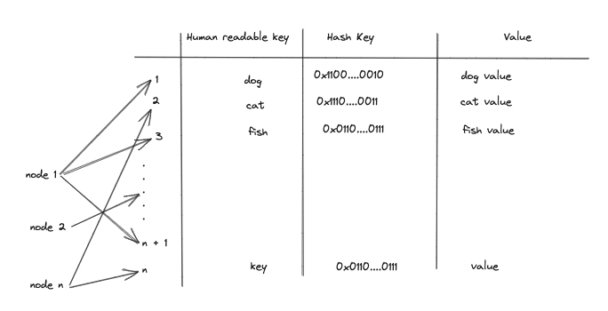
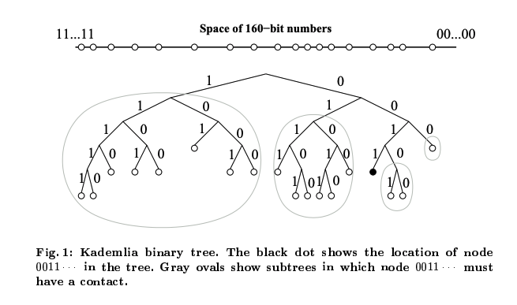
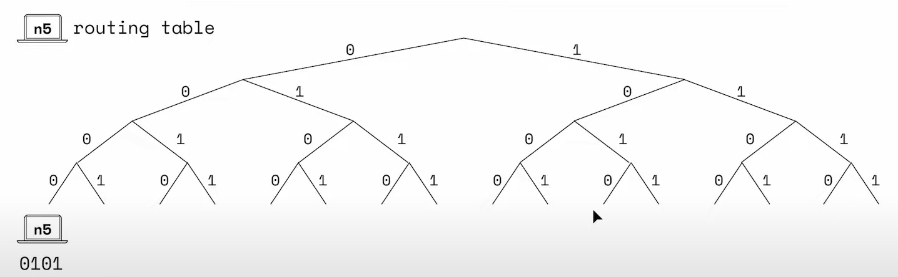
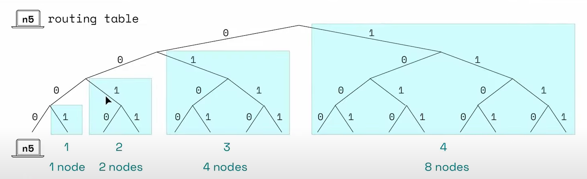
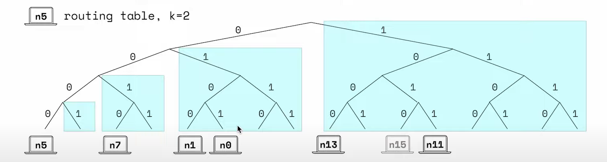
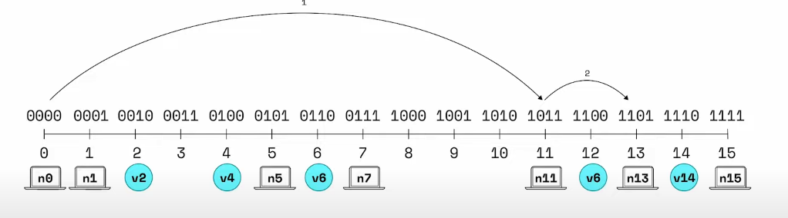

Kademlia using for discovery task in Ethereum Networking layer, to understand How Ethereum networking work, Kademlia is require.

Kademlia provides a way for millions of computers to self-organize into a network, communicate with other computers on the network, and share resources (e.g. files, blobs, objects) between computers, all without a central registry or lookup run by a single person or company

The cool thing is the finding complexity is `O(log₂(n/k))` with `n` is number of network nodes, `k` is bucket size (describe below). For example network contain `10.000.000` nodes and bucket size is `4`, it's only take `log₂(10.000.000/4) ~= 21` times look ups.

# Getting Started

## Distributed Hash Table (DHT)
DHT is a distributed system that provides a lookup service similar to a hash table. Key–value pairs are stored in a DHT, and any participating node can efficiently retrieve the value associated with a given key.

Example of global hash table:

- The key space is for example 2^10 for using 10-bit key
- The number of node could be massive for single machine store, one individual node store same node, at least one node for connected to network so why is call `"distributed"`

### There are 2 question here:
1. The rule for node identified what other node it should store for its local table?
2. If node want to find non-exist other node How could it find them?

## Kademlia Overview

Kademlia takes the same general approach as other DTHs.
Kademlia using <strong>160-bit/strong> for node id.
Kademlia treats nodes as <strong>leaves/strong> in binary tree, with each nodes's position determined by the <strong>shortest prefix of its ID</strong>

# System describe

## Kademlia node
- Kademlia node has a 160-bit NodeID (SHA-1) and IP Address, UDP port

## Distance space
- This 'closeness' is not geographical - distance is defined by the similarity of the node's ID throw `XOR` operator. For example node 1: `0011` and node 2: `0001` distance is `0011` XOR `0001` = 2

## The node state

### The global state
Here minimal version of kademlia with key space 4 bit (2^4 = 16 nodes) and k-bucket = 4. The global state should like below but keep in mind that's machine only store some node of global state.

### The node state

- n5 has node id `0101` but start at path `0-0-0-0` because distance between it's self is 0 (`0101` XOR `0101` is 0)

- `k-bucket` with k = 4 that's mean the remaining nodes divide 4 groups. The keys the buckets are equal to the number of width but also covering more space and more distance

- each bucket contain maximum 2 node, `n-15` will not being added because we already have `n13` and `n11`

### Look up

- `n0` want to know information of `v14`
- `n0` only store bucket-1 (`n1`), bucket-3 (`n5`, `n7`), bucket-4 (`n1`)
- `n11` not store `n14` but store `n13`

The progress will be:
1. `n14` at bucket-4 of `n0`, so `n0` ask closest node at bucket-4 is `n11`
2. `n11` ask closest node at bucket-2 is `n13`
3. `n13` will return `n14` value

So because each node store its k-bucket itself so the maximum complexity will be `O(log₂(n/k))`

# Reference

1. [A Brief Overview of Kademlia, and its use in various decentralized platforms](https://medium.com/coinmonks/a-brief-overview-of-kademlia-and-its-use-in-various-decentralized-platforms-da08a7f72b8f)
2. [Kademlia Paper](https://pdos.csail.mit.edu/~petar/papers/maymounkov-kademlia-lncs.pdf)
3. [Kademlia Explain Videos](https://www.youtube.com/watch?v=1QdKhNpsj8M)