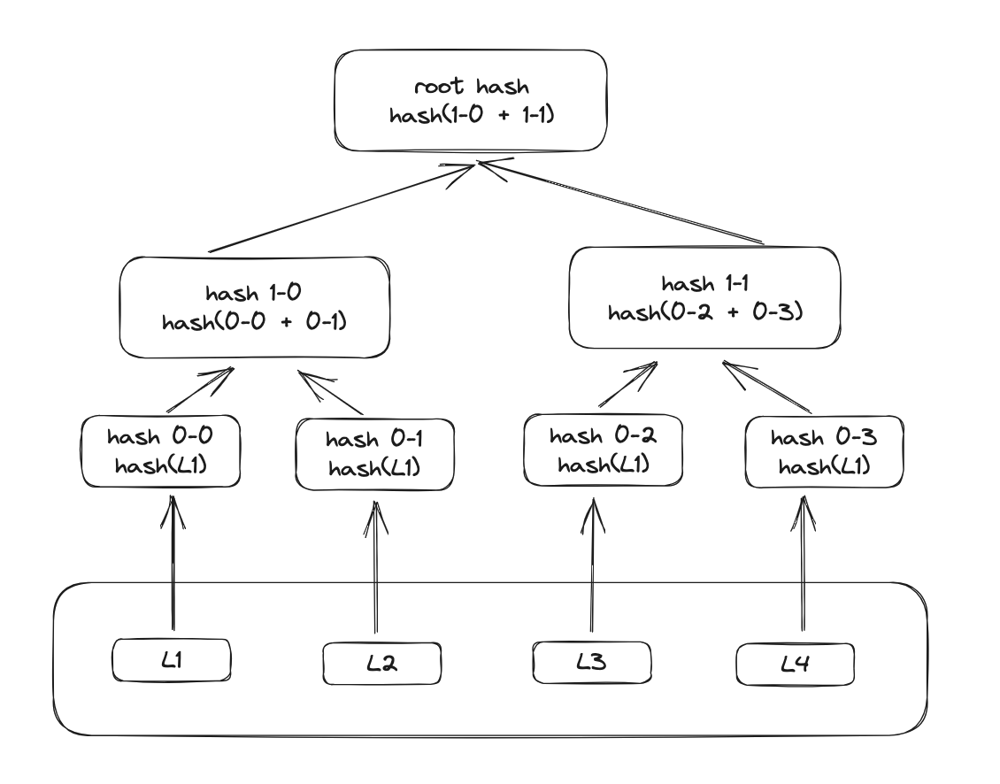
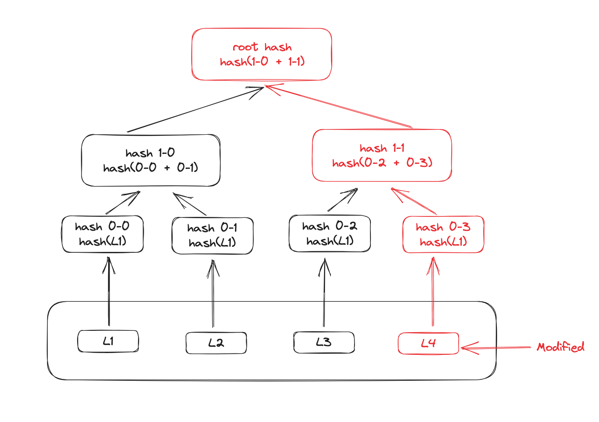
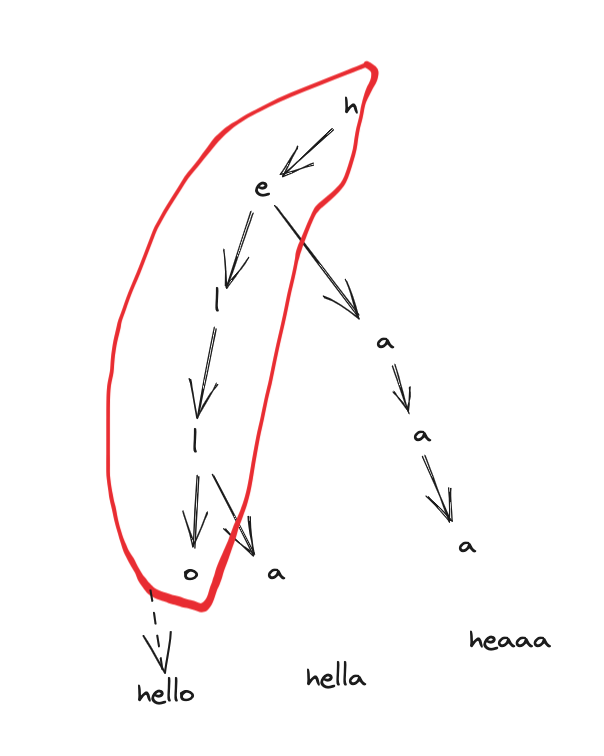
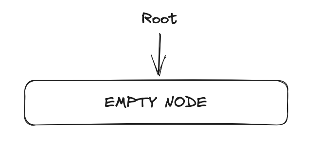
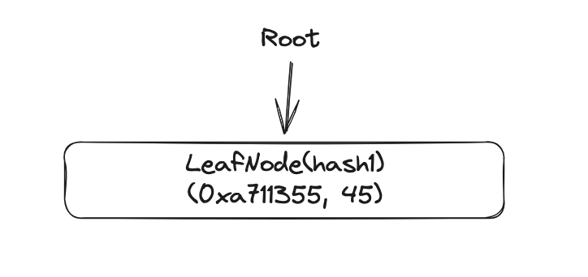
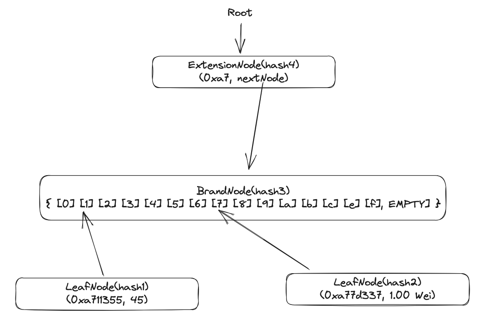
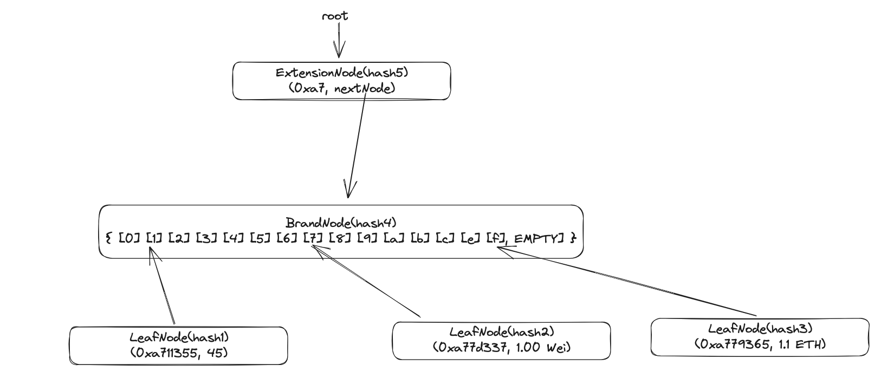
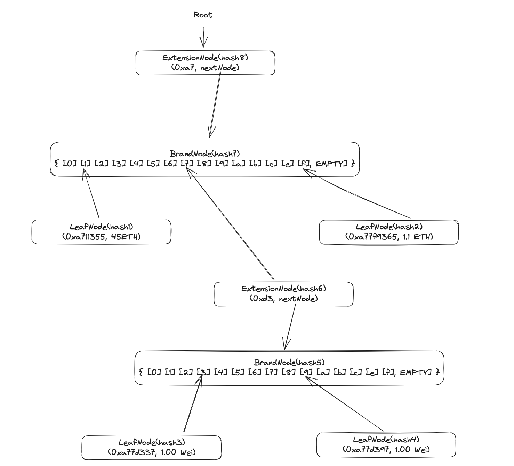

Merkle Patricia Trie is one of the key data structures for the Ethereum’s storage layer. That provides a cryptographically authenticated data structure that can be used to store all (key, value) bindings and the efficiency for inserts, lookups and deletes with O(log(n)) complexity

Merkle Patricia Trie is a combination of <strong>Merkle tree</strong> and <strong>radix tree</strong>.

# Merkle tree

The Merkle tree (hash tree) is a tree in which every "leaf" (node) is labelled with the cryptographic hash of a data block, and every node that is not a leaf (called a branch, inner node, or inode) is labelled with the cryptographic hash of the labels of its child nodes. A hash tree allows efficient and secure verification of the contents of a large data structure. 

If we modified any byte of data the root hash and its path will be change that why result it is "authenticate data"

# Radix tree

A radix tree, also known as a compact prefix tree or a radix trie, is a data structure that represents a space-efficient way to store and retrieve strings or keys with their associated values. It is an extension of a trie data structure where each node represents a partial key or string.

In a radix tree, the edges are labeled with individual characters or substrings, and each node represents a common prefix among its child nodes. This compression technique allows for efficient storage of keys with shared prefixes, reducing the overall space required for storing the data.

Radix tries have one major limitation: they are inefficient. If you want to store one (path, value) binding where the path, like in Ethereum, is 64 characters long (the number of nibbles in bytes32), we will need over a kilobyte of extra space to store one level per character, and each lookup or delete will take the full 64 steps. The Patricia trie introduced in the following solves this issue.

# Merkle Patricia Trie

## Optimizations

### The node types

The Merkle Patricia Trie (trie) of implementation in Ethereum combination of Merkle Tree and optimize radix tree to avoid limitation above. The optimization following 4 kind of node, ach node will be encoded and stored as key-value pairs in the a key-value store:

1. The `empty` node:A non-existent node, represented as an empty string.
2. The `branch` node: A node that has links to a maximum of 16 distinct child notes, corresponding to 16 hex characters. It has also a value field.
3. The `leaf` node: An “end-node” that contains the final part of the key and a value.
4. The `extension` node: A “shortcut” node that stores a part of the key based on a common prefix, and a link to the next node.

> #### 
> - Usually trie is stored in a separate database. The “link” fields in a node stores the hash value of the next node. This hash value is used as a key to retrieve the 
> actual |node from the database during traversal. Therefore searching a key in the trie requires multiple database lookups for getting the nodes in the path.
> - Leaf nodes and extension nodes have similar structure. So a flag is included at the beginning of path value to differentiate between them.

### The rule of updating the trie
In general, the rule is:

1. When stopped at an EmptyNode, replace it with a new LeafNode with the remaining path.
2. When stopped at a LeafNode, convert it to an ExtensionNode and add a new branch and a new LeafNode.
3. When stopped at an ExtensionNode, convert it to another ExtensionNode with shorter path and create a new BranchNode points to the ExtensionNode.

## Examples

We're going to the example below to breaking down How it's actually work. The picture show how we store the world state: 
- `0xa711355: 45 ETH`
- `0xa77d337: 1.00 Wei`
- `0xa7f9365: 1.1 ETH` 
- `0xa77d397: 0.12 ETH`

### Empty tree

When a trie is created, the root node points to an EmptyNode.

- `EMPTY-NODE`: `keccak256(rlp(""))`
- `keccak256`: common hash function using Ethereum
- `rlp`: Recursive Length Prefix (RLP) serialization is used extensively in Ethereum's execution clients. RLP standardizes the transfer of data between nodes in a space-efficient format. The purpose of RLP is to encode arbitrarily nested arrays of binary data, and RLP is the primary encoding method used to serialize objects in Ethereum's execution layer

### Adding the 1st balance

| key   | value                           |
|-------|---------------------------------|
| hash1 | keccak256(rlp([0xa711355, 45ETH])) |

- Empty node turn into Leaf node
- `hash1`: equals `keccak256(rlp([0xa711355, 45]))`

### Adding the 2nd balance

| key   | value                                                                         |
|-------|-------------------------------------------------------------------------------|
| hash1 | keccak256(rlp([0xa711355, 45ETH]))                                            |
| hash2 | keccak256(rlp([0xa77d337, 1.00wei]))                                          |
| hash3 | keccak256(rlp[null,hash1,null,null,null,null,hash2,null,null,null,null,null,null,null,null,null,null]) |
| hash4 | keccak256(rlp([0xa7,hash3]))|

- When adding 2nd balance common prefix found `a7` so create `Extension Node` with share nibble `a7` and value point to `Branch Node(hash3)`
- Branch Node store at position 1 is `Leaf Node(hash1)` and 7 is `Leaf Node (hash2)`

### Adding the 3rd balance

| key   | value                                                                         |
|-------|-------------------------------------------------------------------------------|
| hash1 | keccak256(rlp([0xa711355, 45ETH]))                                            |
| hash2 | keccak256(rlp([0xa77d337, 1.00wei]))                                          |
| hash3 | keccak256(rlp([0xa7f9365, 1.1ETH]))                                           |
| hash4 | keccak256(rlp[null,hash1,null,null,null,null,hash2,null,null,null,null,hash3,null]) |
| hash5 | keccak256(rlp([0xa7,hash4]))   

- when adding `0xa7f9365` we found common prefix `a7` and same previous step `Branch Node` store at position f, so hash of `Branch Node` changed

### Adding the 4th balance

| key   | value                                                                                                |
|-------|------------------------------------------------------------------------------------------------------|
| hash1 | keccak256(rlp([0xa711355, 45ETH]))                                                                   |
| hash2 | keccak256(rlp([0xa7f9365, 1.1ETH]))                                                                  |
| hash3 | keccak256(rlp([0xa77d337, 1.00wei]))                                                                 |
| hash4 | keccak256(rlp([0x77d397, 0.12ETH]))                                                                  |
| hash5 | keccak256(rlp([null,null,null,hash3,null,null,null,null,hash4,null,null,null,null,null,null,null]))  |
| hash6 | keccak256(rlp([0xd3,hash5]))                                                                        |
| hash7 | keccak256(rlp([null,hash1,null,null,null,null,hash7,null,null,null,null,null,null,null,hash2,null])) |
| hash8 | keccak256(rlp([0xa7, hash7]))                                                                           |

- `0xa77d397` has `a7` and `d3` nibbles is same with `0xa77d337` so create another `Extension Node (hash6)` and new `Branch Node (hash3)`
- New `Branch Node` store at position 3 is `Leaf Node(hash3)` and 9 is `Leaf Node (hash4)`

> #### Bonus 
> Another good examples for store transaction with `trie`: https://flow.com/engineering-blogs/ethereum-merkle-patricia-trie-explained

# Tries in Ethereum

Ethereum uses three trie structures.  In Ethereum, every block header stores roots of three trie structures: `stateRoot`, `transactionRoot`, and `receiptsRoot`.

1. `State trie`: The state trie / world state trie represents a mapping between account addresses and the account states. The account state includes the balance, nonce, codeHash, and storageRoot. The storageRoot itself is the root of an account storage trie, which stores the contract data associated with an account.

2. `Transaction trie`: It is created on the list of transactions within a block. The path to a specific transaction in the transaction trie is tracked based on the position of the transaction within the block. Once mined, the position of a transaction in a block does not change. So a transaction trie never gets updated.

3. `Receipt trie`: The receipt records the result of the transaction which is executed successfully. It consists of four items: status code of the transaction, cumulative gas used, transaction logs, Bloom filter (a data structure to quickly find logs). Here the key is an index of transactions in the block and the value is the transaction receipt. Like transaction trie, receipt trie never gets updated. The receiptsRoot is the hash of the root node of the trie structure populated with the receipts of each transaction in the transactions list portion of the block;

# Summary 

Merkle Patricia Trie is a data structure that stores key-value pairs, just like a map. In additional to that, it also allows us to verify data integrity and the inclusion of a key-value pair.

# Reference

1. [MERKLE PATRICIA TRIE - The Origin Ethereum docs](https://ethereum.org/en/developers/docs/data-structures-and-encoding/patricia-merkle-trie/)
2. [Ethereum Merkle Patricia Trie Explained](https://flow.com/engineering-blogs/ethereum-merkle-patricia-trie-explained)
3. [Merkle Patricia Trie in Ethereum: A Silhouette](https://kba.ai/merkle-patricia-trie-in-ethereum-a-silhouette/)
4. [Ethereum Patricia trie - Merkle tree, Radix tree, and trie node](https://medium.com/sota-tek-jsc/ethereum-patricia-trie-merkle-tree-radix-tree-and-trie-node-175b55108fc)
5. [Ethereum Patricia trie implement by Javascript Github source code](https://github.com/ethereumjs/ethereumjs-monorepo/tree/master/packages/trie)