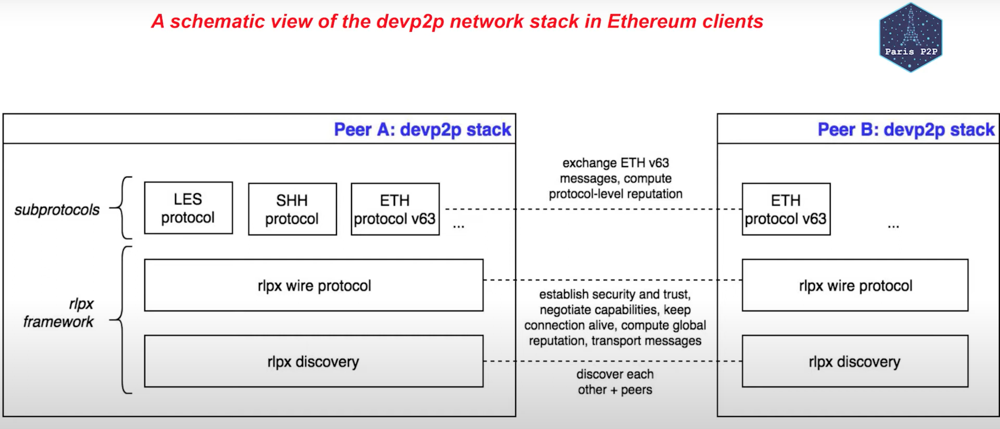
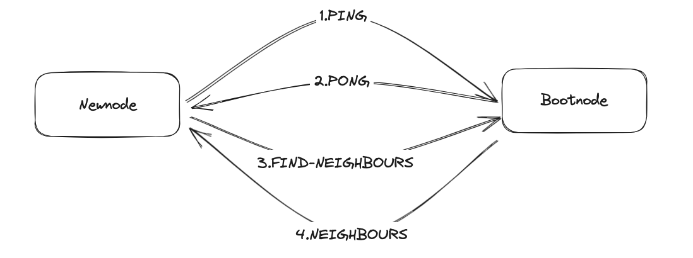
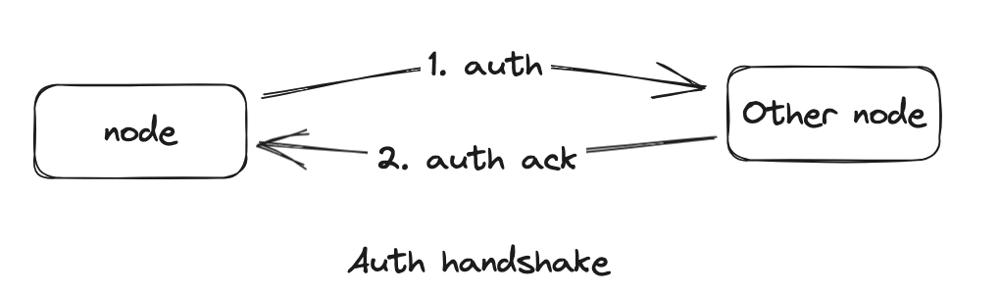
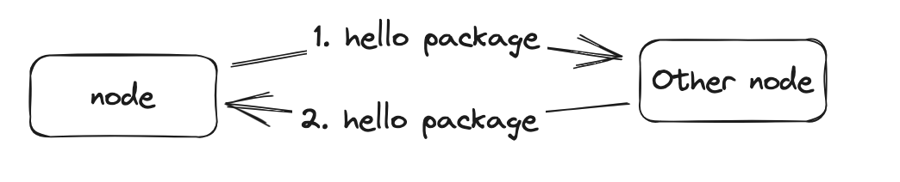

# Overview
A Peer To Peer (p2p) network is an overlay network build on top of public internet
There are two parts to the client software:

- <strong>Execution clients</strong> 
- <strong>Consensus clients</strong>

Each with its own distinct networking stack. As well as communicating with other Ethereum nodes, the execution and consensus clients have to communicate with each other.

The Execution Layer includes some tasks:
- Node Discovery: nodes to discover and locate other Ethereum nodes in the network
- Peer-to-Peer Communication: enables nodes to establish direct communication channels with other peers in the network. It supports both encrypted and unencrypted communication, ensuring secure data exchange between trusted peers

# The Execution layer

Ethereum 1.0 and The Execution layer in Ethereum 2.0 Execution Layer nodes speak other through a framework of network protocol called `devp2p` - that composed of:
- the RLPx framework: `discovery` and `wire protocol`
- Sub-protocols: ETHv63, SHHv1, LESv1, etc

## RLPx discovery

### Bootstrapping
This is bootstrapped using a small set of bootnodes (nodes whose addresses are hardcoded into the client so they can be found immediately and connect the client to peers)

> #### Bootnode
> is node only implement network discovery, only exist to introduce a new node to a set of peer, they do not participate in normal client tasks like syncing the chain

### Bonding 

#### PING-PONG
- This PING includes hashed information about the new node, the bootnode and an expiry time-stamp
- The bootnode receives the PING and returns a PONG containing the PING hash
- If the PING and PONG hashes match then the connection between the new node and bootnode is verified and they are said to have "bonded"

#### FIND-NEIGHBOURS
-  If the nodes are not bonded, the FIND-NEIGHBOURS request will fail, so the new node will not be able to enter the network

RLPx handles peer discovery via a Kademlia DHT-based on UDP protocol. It's bootstrap a seed nodes and performs iterative lookups on the network, filling up a k-bucket peer routing table where nodes take up positions based on their the XOR distance metric.

## RLPx wire protocol

- Established TCP-based encrypted and authenticated sessions with peers (exchange PK and create handshake using share secret)
- Manage their lifecycle
- Performs keep alive (PING-PONG) to prevent DDOS
- Agrees on mutual supported capabilities (subprotocols)

### Session initialization

### Handshake

- A RLPx session between two nodes begins with an initial cryptographic handshake. This involves the node sending an auth message which is then verified by the peer. On successful verification, the peer generates an auth-acknowledgement message to return to the initiator node. This is a key-exchange process that enables the nodes to communicate privately and securely.

#### Hello package

A successful cryptographic handshake then triggers both nodes to send a "hello" message to one another "on the wire". The wire protocol is initiated by a successful exchange of hello messages.

The hello messages contain:

- protocol version
- client ID
- port
- node ID
- list of supported sub-protocols

#### Subprotocols

- Wire protocol: Initially, the wire protocol defined three main tasks: chain synchronization, block propagation and transaction exchange. However, once Ethereum switched to proof-of-stake, block propagation and chain synchronization became part of the consensus layer

- les (light ethereum subprotocol): This is a minimal protocol for syncing light clients

- snap: The snap protocol is an optional extension that allows peers to exchange snapshots of recent states, allowing peers to verify account and storage data without having to download intermediate Merkle trie nodes

- Wit (witness protocol): The witness protocol is an optional extension that enables exchange of state witnesses between peers, helping to sync clients to the tip of the chain.

- Whisper: Whisper was a protocol that aimed to deliver secure messaging between peers without writing any information to the blockchain

# Reference

1. [Video - Introduction to networking protocols between Ethereum nodes @ Paris P2P Festival #0](https://www.youtube.com/watch?v=Bwtjvmjtyjg)
2. [Ethereum Official docs - NETWORKING LAYER](https://ethereum.org/en/developers/docs/networking-layer)
3. [Devp2p specs](https://github.com/ethereum/devp2p/tree/master)