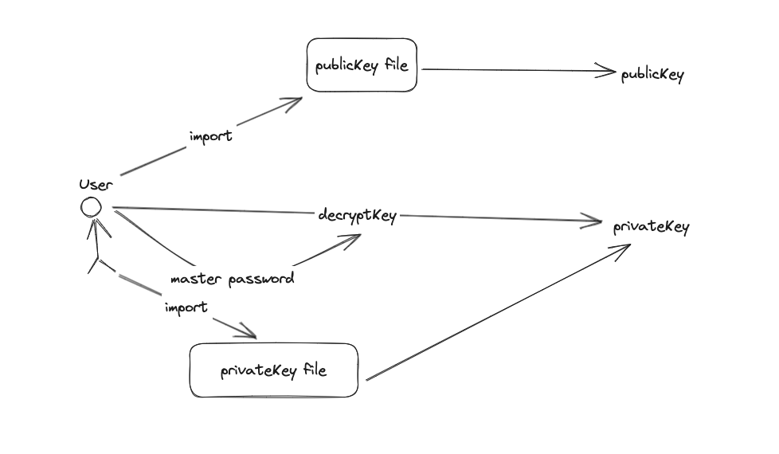
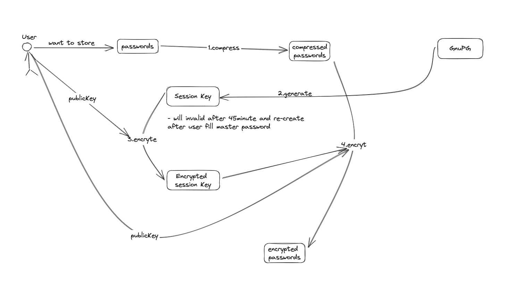
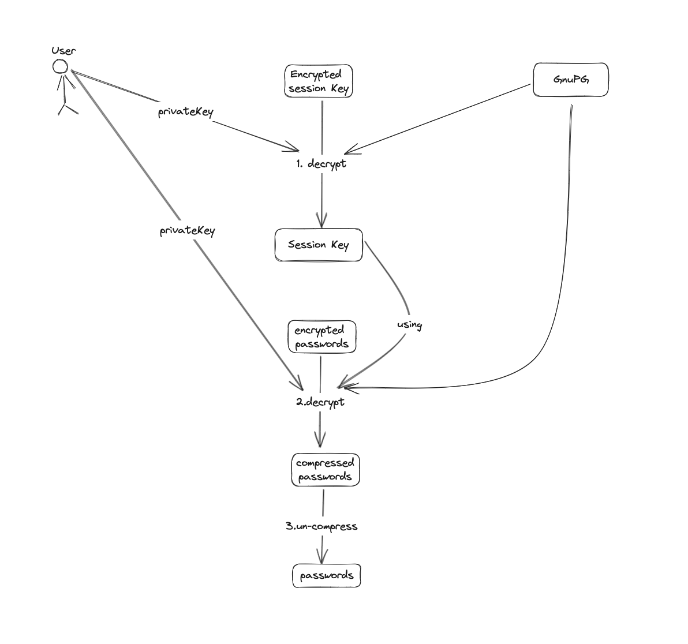

Nowadays, by using various application (social media, bank account, crypto mnemonic,...) we need separate password for each application. We have some scenarios may cause problem:

- We using duplicate password for multiple applications: we expose one that mean expose all
- We using many password and need to remember huge password
- We using paper or note app to remember them, it's note secure we need to trust (or backup) note app, or missing paper

Today, I will describe a method to create your own password manager secure with encrypted data and also easy to backup by store in Github

# Guideline store your password using `pass`
## Introduction
`pass` - which is a command-line password manager that follows the Unix philosophy of doing one thing well. "pass" is an open-source password manager that uses GnuPG (GNU Privacy Guard) for encryption and provides a simple and efficient way to store and retrieve passwords.

`GnuPG` -  GNU Privacy Guard, is a free and open-source software suite used for secure communication and data encryption. It is a complete implementation of the OpenPGP (Pretty Good Privacy) standard, which provides cryptographic privacy and authentication for data and communication.

## Store password using `pass` and `gpg`

### Install `pass` command line tools:

Mac
```
$ brew install pass
```

Ubuntu
```
$ sudo apt-get install pass
```

### Generate key using `gpg`
```
$ gpg --gen-key
```
Fill your `username`, `email`, `password`. we will get `id` - we using `id` for init step `pass`

```
pub   ed25519 2023-06-18 [SC] [expires: 2025-06-17]
      3B82860BFE3B584389F8EDB1E8A5CD4E0812E50C
uid                      cuonghx <cuonghx@gmail.com>
sub   cv25519 2023-06-18 [E] [expires: 2025-06-17]
```

### Initialize new password storage
```
$ pass init 3B82860BFE3B584389F8EDB1E8A5CD4E0812E50C
```

Remember to replace your `id` below to initialize new password storage

### Insert your password (fb, gmail,...) your want to store
- Insert your first facebook password

```
$ pass insert facebook/cuonghx
```
After insert success we will get password store structure like that:
```
Password Store
└── facebook
    └── cuonghx
```
- Insert your gmail password
```
$ pass insert gmail/cuonghx
```

```
Password Store
├── facebook
│   └── cuonghx
└── gmail
    └── cuonghx
```
- Insert your second facebook password

```
$ pass insert facebook/user2
```
```
Password Store
├── facebook
│   ├── cuonghx
│   └── user2
└── gmail
    └── cuonghx
```
- We can view password by using command
```
$ pass show facebook/cuonghx # for facebook password
$ pass show facebook/user2 # for user2 facebook password
$ pass show gmail/cuonghx # for gmail password
```

# Using `git` for backup scenarios

## Config your `git` repository
- You create your git repository (!recommend: private repository) for example `test-pass-store` below
```
$ cd .password-store # Go to .password-store directory
$ pass git init # Initialize git repository
$ pass git remote add origin git@github.com:cuonghx1108/test-pass-store.git
```

## Push your password into your Github
```
$ pass git push origin master
```
You can see your password was encrypted
## Push your `gpg` public key and private key

To able to backup your password when you loss `pass` config `gpg` config we need to push your `gpg` key pairs. Don't worry when attacker have key pairs because your password also protect by symmetric encryption your `gpg` password when we setup at first.

```
$ gpg --output pubic.gpg --armor --export 053BA4556D74C5DBCE0B36AED55334B441B8C166

$ gpg --output private.gpg --armor --export-secret-key 053BA4556D74C5DBCE0B36AED55334B441B8C166
```
- Remember to replace by your `gpg` user `id`

```
$ pass git add .

$ pass git commit -m "Import gpg key 
pairs"

$ pass git push origin master
```

# Backup password

## We're going to delete `pass` and `gpg` config and try to backup password.

```
$ rm -rf .password-store .gnupg
```

We try to `show` password
```
$ pass
Error: password store is empty. Try "pass init".
```
## We clone encrypted password in Github

```
$ git clone git@github.com:cuonghx1108/test-pass-store.git .password-store
```

We need to re-import `gpg` key pairs also 
```
$ gpg --import private.gpg
``` 

We view our imported password

```
$ pass show facebook/cuonghx
```

# Technique describe 
- How GnuPG secure your password and protect your password even if you missing your key pairs

## `gpg` decrypt key pairs using your master password - this password for `gpg` you fill at first steps



## `gpg` encrypt key using your public key, this also generate session key and will be expired after 45 minutes



## `gpg` decrypt key using your private key



### The attacker want to get your password need 2 protected information: 
- Your github repository (protect by private github repository)
- Your master password (only you know that)

